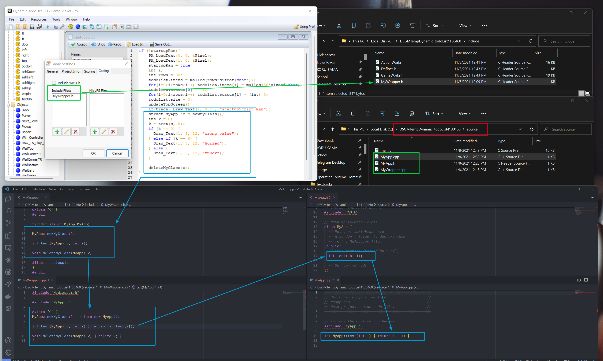
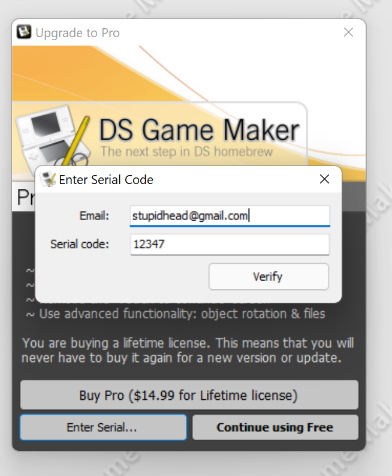
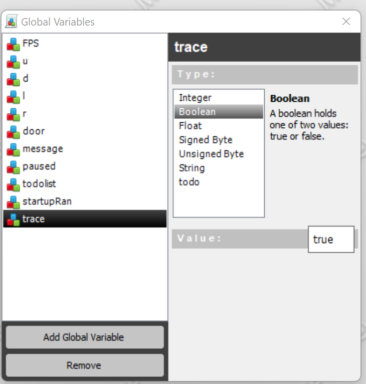
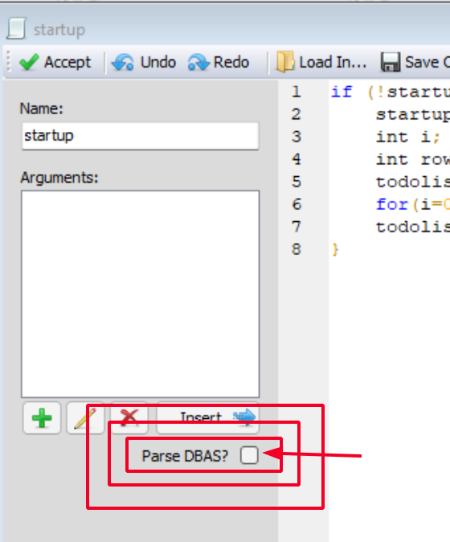
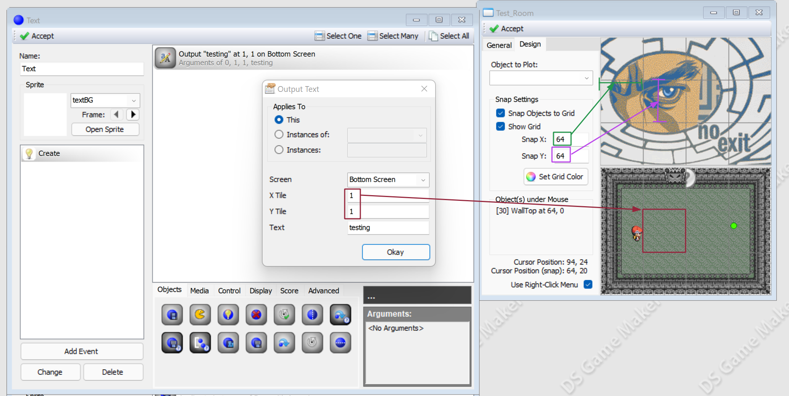
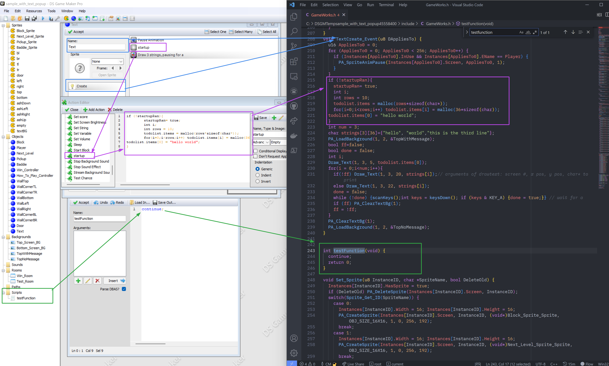
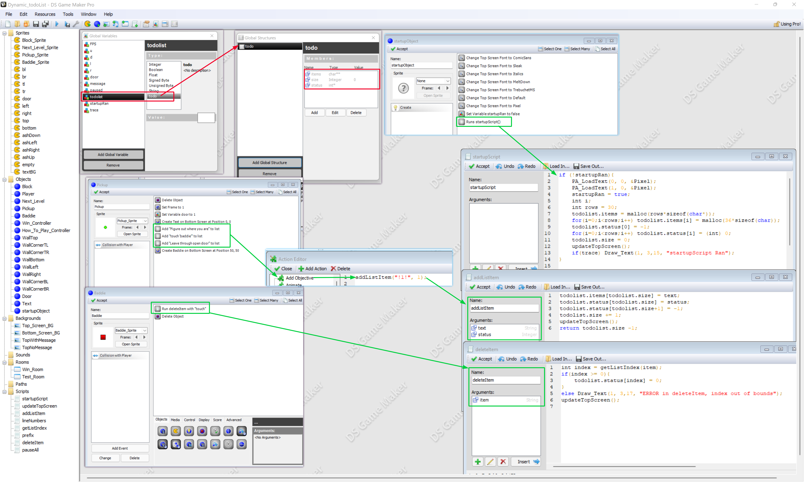
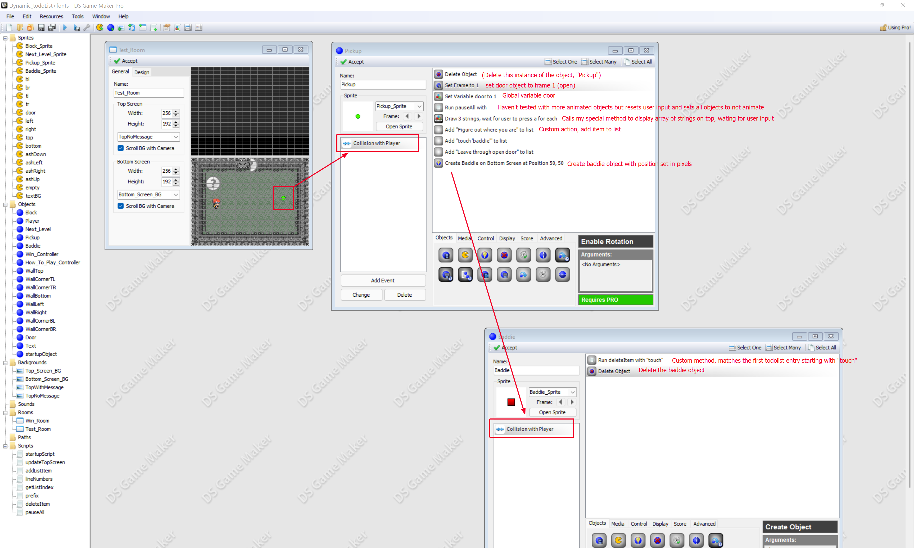

# No Exit
## To build:
1. Copy the files inside `CustomActions` to `C:\Program Files (x86)\DS Game Maker\Actions\`

2. Choose the most recent `.dsgm` project file and open it in DSGM

3. Copy the following three files from `CPP BACKUP` to `C:\DSGMTempSomethingRandom` (choosing the right folder of course, it's randomly generated every time)

4. Compile!

## Working on C++
Make sure to edit C++ code in the git repository, and copy the updated files to the source folder when you actually build. \
The exception to this is MyWrapper.h
When changed, you need to reimport it. See the other C++ section below for how that works.

## Custom Actions
Actions are a great way of making it easy for non-CodeMonkeys to use our code!\
Unfortunately, they do not get saved in the project. \
Just as you copied the actions in `CustomActions` to  `C:\Program Files (x86)\DS Game Maker\Actions\` when building, you also need to copy new or edited actions from `C:\Program Files (x86)\DS Game Maker\Actions\` to the `CustomActions` folder so other members can use them. 

## Installer
**Note: You need to go to `C:\Windows\System32\drivers\etc` and add the following
line to your hosts file:**\
`127.0.0.1 dsgamemaker.com`\
To do this, you will have to open notepad as admin, then File->Open

## C++ Code
To use C++ in your code:

1. Tools -> Game Settings -> Coding -> Include Files: 
    * add `MyWrapper.h`
2. Copy other 3 files to `C:/DSGM_TEMP_FOLDER/source` (whatever it's called)
3. Put the following code somewhere in your project:
```c
struct MyApp *c = newMyClass();
PA_LoadText(1, 0, &Pixel); // Include this if you haven't initialized the text yet
int k = 0;
k = test(c, 5);
if (k == 0) {
  Draw_Text(1, 3, 12, "wrong value");
} else if (k == 6) {
  Draw_Text(1, 3, 12, "Worked");
} else {
  Draw_Text(1, 3, 12, "failure");
}
Draw_Text(1, 3, 13, stringTest(c));
Draw_Text(1, 3, 14, stringTest2(c));	
deleteMyClass(c);
```
You should see the following text on the top screen:
```
WORKED
YO
HELLO MY DUDES
```

> Note: This is already inside the startupScript function. 
> Also, any functions which clear text off the screen called after startupscript will remove this text, since startupscript only runs once

### C++ Example
The following image may help you understand:



The green arrow shows how DSGM automatically pulls the `MyWrapper.h`\
The blue double box shows the implementation using C++ functions\
The blue arrows/boxes walk you through how c++ code gets called. \

## Examples
Everything in the examples folder is a project for PALib. It is useful to see
all of the functions available and how it works.\
To build, double click on `build.bat`

# DSGM Info:

## Activating
Assuming everything went well with the installer and the hosts file, you should be able to activate pro mode without any issues!




## Trace
I added a trace boolean to the project file. When the global variable is set to true, it prints more info!

 \
To add trace printing, simply use the following notation: 

```c
if(trace) PA_Print(0,"The value in x is: %d\n",x);// 0 is bottom, 1 is top
```

## A Random Warning
Don't click this, ever. It is checked by default. 



## Tiling
DSGM (and the DS) has two coordinate systems: 
1. pixel position (relative to the screen)
2. tile position (relative to the background, which can be much bigger than the screen)

How to change the tile size and see how it maps out is shown in this image:

 \
You define the x and y size of each tile (in pixels) for the level, then refer to them from the top left corner to the bottom right corner.

## DSGM to C/C++
This image is your reference for how DSGM compiles to code. 

 \

- Blue shows you how a trigger for an object becomes a function. 
- Purple shows you that actions are not translated into functions. Instead, they are "blocks of code" which are dumped into whatever trigger function you are in. They cannot be called using function names. 
- Green shows how scripts work. Scripts become actual functions, and should be able to be called as functions. I don't know how to set the return type on these, or if that is possible, so we might need to store output in global output variables.

## ToDo List implementation 
The following screenshots may help you understand how to use DSGM to implement stuff. \
This code creates a dynamic "To Do list" which will be used for player objectives. \
This is probably most helpful for understanding structs and global variables \
### Backend

 \

### Using the ToDo List

 
